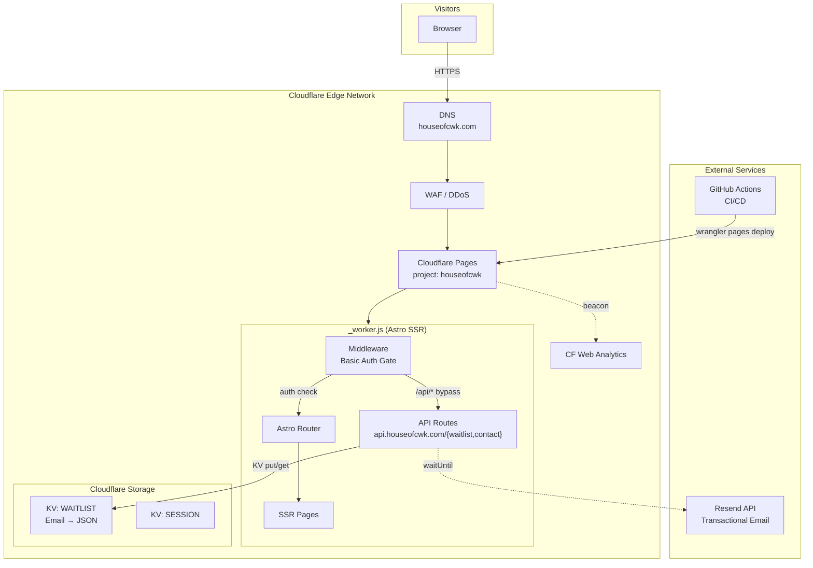
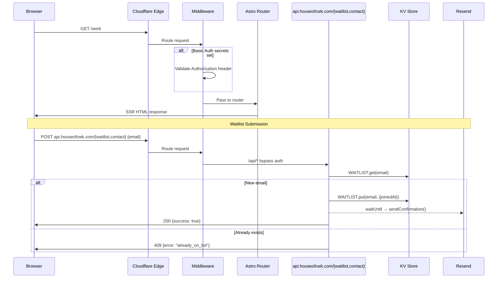
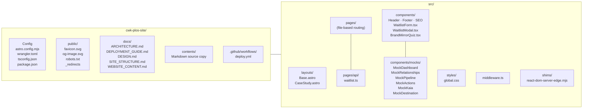
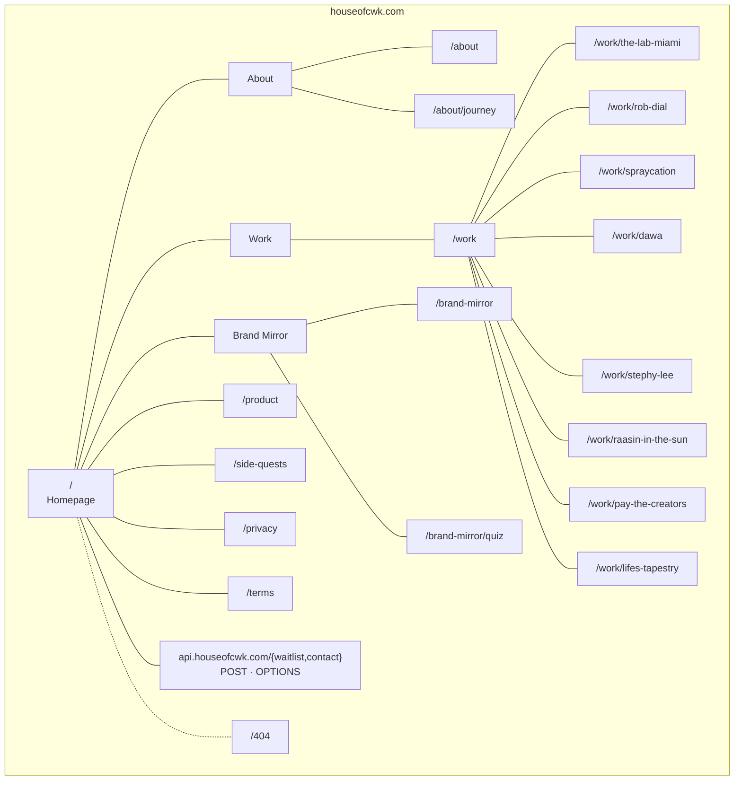
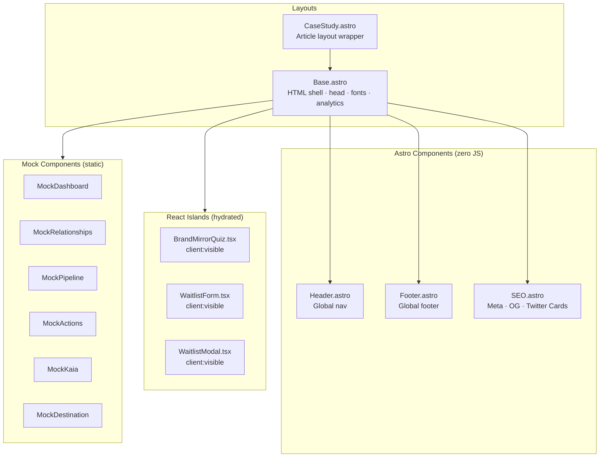
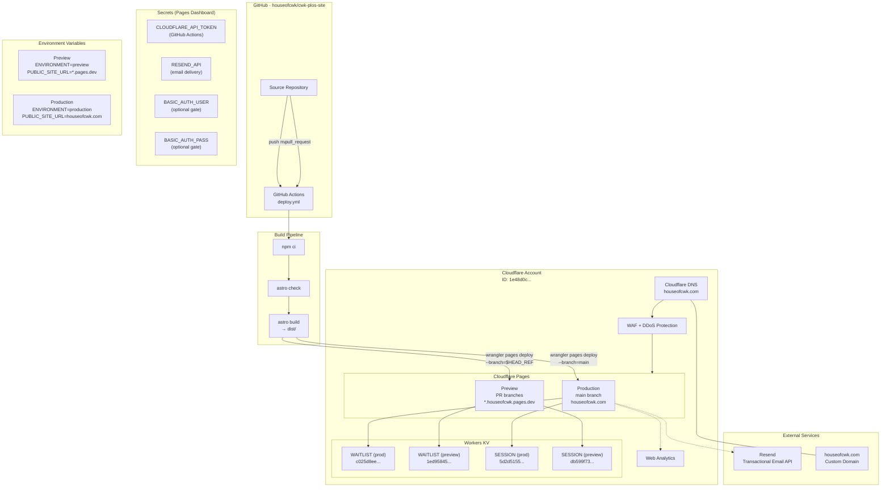
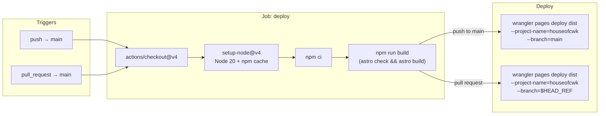
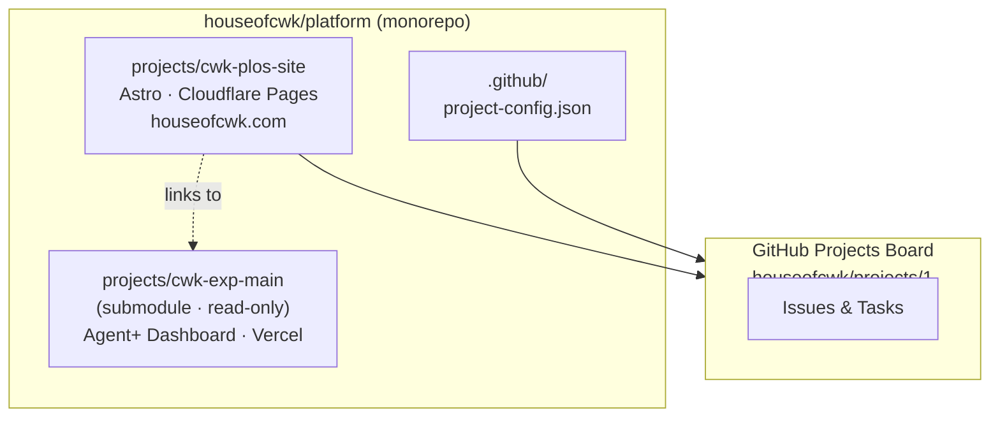

# Architecture — CWK PLOS Site

> `cwk-plos-site` · Astro 5 · Cloudflare Pages · houseofcwk.com

> **Note:** The diagrams below were drawn pre-Sanity (when the waitlist ran as
> an Astro API route under `_worker.js` SSR). Current truth:
> - Pages is **pure static** — no `_worker.js`, no Basic Auth middleware.
> - Content pages are built at deploy time from **Sanity**
>   (project `3fsa3jok`, dataset `production`).
> - APIs live in a **single consolidated Cloudflare Worker** at
>   [`workers/api/`](../workers/api/) (`cwk-api-prod`), bound to
>   `api.houseofcwk.com`. Handlers: `POST /waitlist`, `POST /contact`.
> - The `KV: WAITLIST` namespace is reused byte-for-byte; `CONTACTS` +
>   `RATE_LIMIT` KV are bound to the same worker.
>
> The sequence/structure diagrams below still capture the request shape
> correctly, but paths/bindings should be read as
> `api.houseofcwk.com/{waitlist,contact}` rather than `/api/waitlist`.

---

## High-Level System Architecture

---

## Request Flow

---

## Project Structure

---

## Page & Route Map

### Legacy Redirects (301)

| Old Path | New Path |
|----------|----------|
| `/aboutkris` | `/about` |
| `/krisjourneyarticle` | `/about` |
| `/flexlink` | `/work` |
| `/thelabmiamicampusarticle` | `/work/the-lab-miami` |
| `/robdialarticle` | `/work/rob-dial` |
| `/spraycationmuraltour` | `/work/spraycation` |
| `/dawaarticle` | `/work/dawa` |
| `/stephyleearticle` | `/work/stephy-lee` |
| `/raasininthesunarticle` | `/work/raasin-in-the-sun` |
| `/beatstarsarticle` | `/work/pay-the-creators` |
| `/lifestapestryarticle` | `/work/lifes-tapestry` |
| `/brandmirrorlobby` | `/brand-mirror` |
| `/brandmirror` | `/brand-mirror` |

---

## Component Architecture

---

## Deployment Resource Map

---

## CI/CD Pipeline

---

## Technology Stack

| Layer | Technology | Purpose |
|-------|-----------|---------|
| **Framework** | Astro 5 | SSR-capable static-first framework |
| **Output mode** | `output: 'server'` | Full SSR via Cloudflare Workers |
| **Adapter** | `@astrojs/cloudflare` | Generates `_worker.js` for Pages |
| **Islands** | React 19 + `@astrojs/react` | Interactive components (quiz, forms) |
| **Sitemap** | `@astrojs/sitemap` | Auto-generated `sitemap-index.xml` |
| **Language** | TypeScript (strict) | Type safety across all source files |
| **Styling** | Scoped CSS + `global.css` variables | Brand design system tokens |
| **Edge runtime** | Cloudflare Pages (Workers) | Global edge deployment |
| **KV storage** | Cloudflare Workers KV | Waitlist emails, sessions |
| **Email** | Resend API | Transactional confirmation emails |
| **CI/CD** | GitHub Actions | Automated build + deploy |
| **DNS / CDN** | Cloudflare | DNS, WAF, DDoS, caching |
| **Analytics** | Cloudflare Web Analytics | Privacy-first, no-cookie analytics |
| **Assets** | Git LFS | Large images tracked via `.gitattributes` |

---

## Runtime Configuration

### Environment Split

| Variable | Preview | Production |
|----------|---------|------------|
| `ENVIRONMENT` | `preview` | `production` |
| `PUBLIC_SITE_URL` | `https://houseofcwk.pages.dev` | `https://houseofcwk.com` |
| `FROM_EMAIL` | `hello@houseofcwk.com` | `hello@houseofcwk.com` |
| `FROM_NAME` | `CWK. Experience` | `CWK. Experience` |
| `REPLY_TO_EMAIL` | `hello@cwkexperience.com` | `hello@cwkexperience.com` |
| `REPLY_TO_NAME` | `Kris San — CWK.` | `Kris San — CWK.` |

### Secrets (set via `wrangler pages secret put`)

| Secret | Purpose |
|--------|---------|
| `RESEND_API` | Resend API key for confirmation emails |
| `BASIC_AUTH_USER` | Optional HTTP Basic Auth username (preview gating) |
| `BASIC_AUTH_PASS` | Optional HTTP Basic Auth password (preview gating) |

---

## Monorepo Context

The PLOS marketing site is the public-facing presence for CWK. It links to but is architecturally independent from the Agent+ Dashboard application (`cwk-exp-main`), which is a React SPA deployed to Vercel and mounted as a read-only Git submodule in the platform monorepo.
